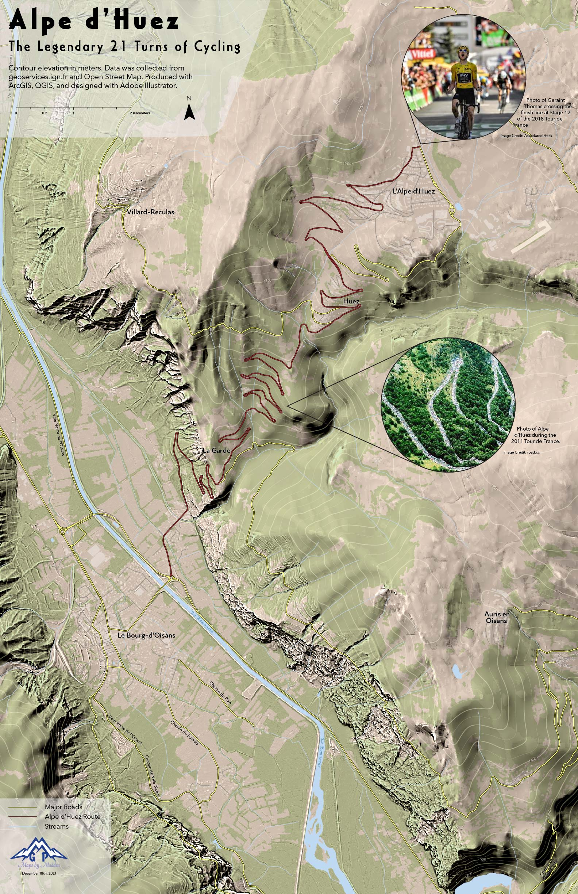

# Alpe d’Huez: A Modern Look at the Legendary 21 Turns of Cycling

## The 21 Turns of Cycling in the Tour de France

(Image credit: Graham Watson)

### Topographic Map of Alpe d’Huez in the French Alps

[Download a PDF of this Map](Final-Alpe.pdf)

https://gmadd89.github.io/21-Turns/